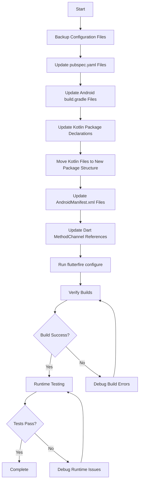

# Design Document: App Rebranding from Muari Course to RimApp

## Overview

This design document outlines the systematic approach to rebrand two Flutter applications (admin_app and wassalni_driver) from "Muari Course" to "RimApp" and reconfigure them with a new Firebase project. The rebranding involves changes across multiple layers: Flutter configuration, Android native code, iOS configuration, and Firebase integration.

The rebranding will maintain all existing functionality while updating identifiers, package names, display names, and backend configurations. Both applications will be processed in parallel using the same pattern to ensure consistency.

## Architecture

### Application Structure

Both applications follow the standard Flutter project structure:
```
app_directory/
├── android/
│   ├── app/
│   │   ├── src/main/
│   │   │   ├── kotlin/com/[package]/[app]/
│   │   │   └── AndroidManifest.xml
│   │   ├── build.gradle
│   │   └── google-services.json
│   └── settings.gradle
├── ios/
│   └── Runner/
│       └── GoogleService-Info.plist
├── lib/
│   ├── main.dart
│   └── services/
└── pubspec.yaml
```

### Rebranding Layers

1. **Flutter Layer**: Package names, descriptions, and display strings
2. **Android Native Layer**: Application IDs, package names, Kotlin packages, and service declarations
3. **iOS Native Layer**: Bundle identifiers and display names
4. **Firebase Layer**: Project configuration and service files
5. **Build Configuration Layer**: Gradle files and build scripts

## Components and Interfaces

### 1. Flutter Configuration Component

**Files Affected:**
- `admin_app/pubspec.yaml`
- `wassalni_driver/pubspec.yaml`

**Changes:**
- Package name: `muari_course_admin` → `rimapp_admin`
- Package name: `muari_course_driver` → `rimapp_driver`
- Description: Update to reference RimApp
- No changes to dependencies or Flutter SDK version

### 2. Android Application ID Component

**Files Affected:**
- `admin_app/android/app/build.gradle`
- `wassalni_driver/android/app/build.gradle`
- `wassalni_driver/android/app/build.gradle.kts` (if exists)

**Changes:**
- Application ID: `com.muaricourse.admin` → `com.rimapp.admin`
- Application ID: `com.muaricourse.driver` → `com.rimapp.driver`
- Namespace: Update to match new application IDs
- Comments: Update references to "Muari Course"

### 3. Android Native Code Component

**Driver App Kotlin Files:**
- `MainActivity.kt`
- `NotificationService.kt`
- `ForegroundRideService.kt`
- `RideNotificationHelper.kt`
- `NotificationReceiver.kt`

**Admin App Kotlin Files:**
- `MainActivity.kt`

**Changes:**
- Package declaration: `package com.muaricourse.[app]` → `package com.rimapp.[app]`
- Directory structure: Move files from `com/muaricourse/` to `com/rimapp/`
- Fully qualified class names in code
- MethodChannel names: `com.muaricourse.driver/app_launcher` → `com.rimapp.driver/app_launcher`
- Intent actions: `com.muaricourse.driver.OPEN_APP` → `com.rimapp.driver.OPEN_APP`

### 4. Android Manifest Component

**Files Affected:**
- `admin_app/android/app/src/main/AndroidManifest.xml`
- `wassalni_driver/android/app/src/main/AndroidManifest.xml`

**Changes:**
- Activity names: Update to reference new package structure
- Service names: Update to reference new package structure
- Receiver names: Update to reference new package structure
- Intent action names: Update custom actions
- Display label: "موري كورس" → "RimApp Admin" / "RimApp Driver"

### 5. Flutter Dart Code Component

**Files Affected:**
- `wassalni_driver/lib/services/notification_service.dart`
- `wassalni_driver/lib/main.dart`

**Changes:**
- MethodChannel identifiers: Update to use new package names
- No functional logic changes

### 6. Firebase Configuration Component

**Process:**
1. Run FlutterFire CLI with new project: `flutterfire configure --project=rimappmuaritania`
2. Select both Android and iOS platforms for both apps
3. Replace generated configuration files

**Files Generated/Updated:**
- `admin_app/android/app/google-services.json`
- `admin_app/ios/Runner/GoogleService-Info.plist`
- `wassalni_driver/android/app/google-services.json`
- `wassalni_driver/ios/Runner/GoogleService-Info.plist`
- `lib/firebase_options.dart` (in both apps)

**Prerequisites:**
- Firebase project "rimappmuaritania" must exist
- Android apps must be registered with package names:
  - `com.rimapp.admin`
  - `com.rimapp.driver`
- iOS apps must be registered with bundle identifiers

## Data Models

No data model changes are required. This is purely a configuration and identifier update. All Firestore collections, documents, and data structures remain unchanged.

## Error Handling

### Build Errors

**Scenario:** Gradle build fails due to package name mismatch
- **Detection:** Build error messages referencing old package names
- **Resolution:** Verify all build.gradle files use consistent application IDs
- **Prevention:** Update all references atomically

**Scenario:** Kotlin compilation fails due to package declaration mismatch
- **Detection:** Compilation errors about package structure
- **Resolution:** Ensure directory structure matches package declarations
- **Prevention:** Move files to correct directories before updating package declarations

### Runtime Errors

**Scenario:** MethodChannel communication fails
- **Detection:** Flutter logs show channel not found errors
- **Resolution:** Verify MethodChannel names match in both Dart and Kotlin code
- **Prevention:** Update channel names in paired files simultaneously

**Scenario:** Services not found at runtime
- **Detection:** Android logs show ClassNotFoundException
- **Resolution:** Verify AndroidManifest.xml references correct fully qualified class names
- **Prevention:** Update manifest after moving Kotlin files

### Firebase Configuration Errors

**Scenario:** Firebase initialization fails
- **Detection:** Firebase error messages about configuration
- **Resolution:** Re-run flutterfire configure command
- **Prevention:** Ensure Firebase project has apps registered with correct package names

**Scenario:** google-services.json package name mismatch
- **Detection:** Build warning about package name mismatch
- **Resolution:** Verify google-services.json contains correct package_name
- **Prevention:** Register apps in Firebase Console before running flutterfire configure

## Testing Strategy

### Pre-Rebranding Verification

1. Document current application state
2. Verify both apps build successfully
3. Note current Firebase project configuration
4. Backup current configuration files

### Post-Rebranding Verification

#### Build Verification
1. Clean build directories: `flutter clean` in both apps
2. Get dependencies: `flutter pub get` in both apps
3. Build Android APKs: `flutter build apk` in both apps
4. Build iOS (if on macOS): `flutter build ios` in both apps
5. Verify no build errors or warnings related to package names

#### Configuration Verification
1. Search codebase for "muaricourse" - should return no results in config files
2. Search codebase for "muari course" - should return no results in user-facing strings
3. Verify all Kotlin files are in correct directory structure
4. Verify all AndroidManifest.xml references are correct

#### Runtime Verification
1. Install admin app on Android device
2. Verify app launches successfully
3. Verify Firebase connection works
4. Install driver app on Android device
5. Verify app launches successfully
6. Verify notifications work (MethodChannel communication)
7. Verify background services start correctly

#### Firebase Verification
1. Check Firebase Console shows both apps registered
2. Verify package names match in Firebase Console
3. Test Firestore read/write operations
4. Verify Firebase Analytics (if used) reports correctly

### Rollback Plan

If critical issues are discovered:
1. Restore backed-up configuration files
2. Revert Kotlin package changes
3. Revert pubspec.yaml changes
4. Run `flutter clean` and rebuild
5. Restore original Firebase configuration

## Implementation Notes

### Order of Operations

The rebranding must follow this specific order to minimize errors:

1. **Backup Phase**: Create backups of all configuration files
2. **Flutter Phase**: Update pubspec.yaml files
3. **Android Build Config Phase**: Update build.gradle files
4. **Kotlin Code Phase**: Update package declarations and move files
5. **Android Manifest Phase**: Update AndroidManifest.xml files
6. **Dart Code Phase**: Update MethodChannel references
7. **Firebase Phase**: Run flutterfire configure
8. **Verification Phase**: Build and test both applications

### Critical Dependencies

- **Kotlin File Movement**: Must happen before AndroidManifest updates
- **Application ID Updates**: Must happen before Firebase configuration
- **MethodChannel Updates**: Must be synchronized between Dart and Kotlin

### Platform-Specific Considerations

**Android:**
- Package name changes require uninstalling old app before installing new one
- Signing keys remain the same (no impact on release builds)
- Deep links and intent filters need verification

**iOS:**
- Bundle identifier changes require new provisioning profiles for release
- Development builds should work immediately
- Push notification certificates may need updating

### Firebase Project Setup

Before running flutterfire configure, ensure:
1. Firebase project "rimappmuaritania" exists
2. Android apps are registered with correct package names
3. iOS apps are registered with correct bundle identifiers
4. SHA-1 fingerprints are added for Android apps (if using authentication)

## Diagrams

### Rebranding Flow



### Package Structure Transformation

```
Before:
com/muaricourse/admin/MainActivity.kt
com/muaricourse/driver/MainActivity.kt
com/muaricourse/driver/NotificationService.kt
com/muaricourse/driver/ForegroundRideService.kt
com/muaricourse/driver/RideNotificationHelper.kt
com/muaricourse/driver/NotificationReceiver.kt

After:
com/rimapp/admin/MainActivity.kt
com/rimapp/driver/MainActivity.kt
com/rimapp/driver/NotificationService.kt
com/rimapp/driver/ForegroundRideService.kt
com/rimapp/driver/RideNotificationHelper.kt
com/rimapp/driver/NotificationReceiver.kt
```

### File Change Impact Matrix

| File Type | Admin App | Driver App | Change Type |
|-----------|-----------|------------|-------------|
| pubspec.yaml | ✓ | ✓ | Package name |
| build.gradle | ✓ | ✓ | Application ID |
| MainActivity.kt | ✓ | ✓ | Package + Move |
| AndroidManifest.xml | ✓ | ✓ | References + Label |
| NotificationService.kt | - | ✓ | Package + Move |
| ForegroundRideService.kt | - | ✓ | Package + Move |
| RideNotificationHelper.kt | - | ✓ | Package + Move |
| NotificationReceiver.kt | - | ✓ | Package + Move |
| notification_service.dart | - | ✓ | MethodChannel |
| main.dart | - | ✓ | MethodChannel |
| google-services.json | ✓ | ✓ | Firebase Config |
| GoogleService-Info.plist | ✓ | ✓ | Firebase Config |
